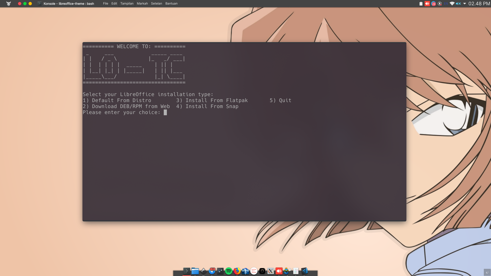
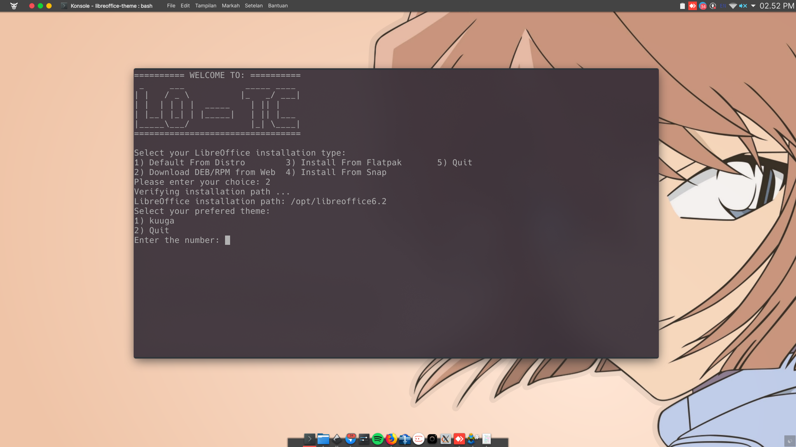
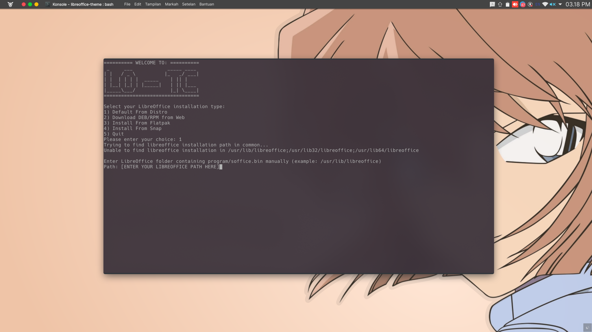

[EN Version](README.md)
# LibreOffice Theme Changer (LO-TC)

LibreOffice Theme Changer atau LO-TC (baca: Lotis) merupakan sebuah perkakas sederhana untuk membantu Anda mengubah tema pada LibreOffice versi 6.2 atau terbaru. LO-TC memungkinkan Anda untuk mengganti gambar splash dan tema persona pada LibreOffice dengan gambar yang Anda inginkan dengan sangat mudah.

## Memasang Tema Via LO-TC

Kami menyediakan beberapa tema yang dapat Anda pilih dan gunakan secara langsung, namun Anda juga dapat menambahkan sendiri tema yang Anda inginkan. Langkah-langkah membuat tema ini akan dibahas pada bagian selanjutnya.

Untuk dapat menjalankan LO-TC, silakan ikuti tahapan-tahapan berikut ini. Pastikan Git sudah terpasang pada sistem operasi Anda.
```bash
$ git clone https://github.com/raniaamina/libreoffice-theme.git
$ cd libreoffice-theme
$ bash install.sh
```


LibreOffice mendukung banyak metode pemasangan, masing-masing metode memiliki direktori tersendiri untuk menyimpan berkas konfigurasi LibreOffice. Untuk itu, silakan pilih metode pemasangan yang sesuai agar tema dapat dipasang dengan lancar.

Langkah selanjutnya, adalah menentukan tema yang ingin dipasang. Daftar tema yang tersedia dapat dilihat di direktori `themes`.



Untuk memasang tema, Anda diharuskan memiliki akses root. Anda akan diminta untuk memasukkan sandi root setelah Anda menentukan tema yang akan dipasang. Selain itu, pastikan pula bahwa aplikasi LibreOffice tidak sedang digunakan/berjalan.

Setelah pemasangan selesai, Anda dapat memlih apakah akan langsung menerapkan tema terpilih atau tidak. Anda dapat mengaktifkan tema secara manual melalui menu `perkakas` --> `Opsi`--> `Personalisasi`. Perhatikan gambar berikut.


#### Catatan khusus

Untuk saat ini LO-TC dapat berjalan baik pada distribusi Debian, openSUSE, Fedora, Ubuntu, dan distro-dsitro turunannya. Untuk distro-distro selain yang disebutkan harus memasukkan path LibreOffice secara manual. Perhatikan gambar berikut.




## Manghapus Tema LO-TC

Untuk mengahpus tema via LO-TC cukup jalankan perintah

```bash
$ bash uninstall.sh
```

kemudian pilih tema yang ingin dihapus.

## Membuat Tema Kustom untuk LO-TC

Berikut langkah-langkah yang dapat Anda ikuti untuk membuat tema kustom LibreOffice.


### Hirarki Folder Tema

LO-TC menyusun konfigurasi tema dalam sebuah hirarki folder khusus agar mempermudah siapa saja yang ingin membuat kustom tema dan memasangnya menggunakan LO-TC. Simpan dan tempatkan masing-masing aset yang nantinya akan dibuat ke dalam direktori **themes**. LO-TC akan secara otomatis membaca daftar tema yang terdapat pada direktori, kami menyebutnya tema siap pasang. 

silakan perhatikan hirarki direktori berikut ini untuk membantu Anda mengetahui di mana lokasi penyimpanan aset-aset yang akan Anda buat pada langkah-langkah selanjutnya.

```bash
themes
└── nama-tema
    ├── program
    │   ├── intro.png
    │   └── sofficerc
    ├── screenshot.png
    └── share
        └── gallery
            └── personas
                ├── nama-tema
                │   ├── footer.png
                │   ├── header.png
                │   └── preview.png
                └── personas_list.txt

```

### Menyiapkan Aset-Aset Gambar

Gambar-gambar yang harus dipersiapkan untuk membuat tema ini antara lain:

1. Splash
Splash merupakan gambar yang pertama kali muncul ketika Anda menjalankan LibreOffice. Sebenarnya tak ada ukurab baku untuk gambar splash ini, namun kami sarankan untuk menggunakan ukuran yang juga digunakan oleh LibreOffice yaitu 661 x 169 piksel. Anda dapat membuat splash menggunakan template yang sudah kami sediakan. Silakan unduh melalui [tautan ini](template/intro.svg)

2. Header
Header merupakan gambar yang tampak pada bagian atas program LibreOffice, tepatnya di area menu LibreOffice. Standar ukuran header ini kami ambil dari standar ukuran aset gambar pada tema-tema persona. Kami sangat menyarankan agar desain yang dibuat untuk header ini memanfaatkan area pojok kanan atas. Alasan teknisnya adalah karena area ini merupakan area palinga aman dan tidak mengganggu visibilitas ikon-ikon pada menu. Kami telah menyiapkan template header yang siap untuk dimodifikasi. Silakan unduh melalui [tautan ini](template/header.svg)

3. Footer
Footer merupakan gambar yang akan tampil pada area bawah program LibreOffice. Pada dasarnya footer ini akan tersembunyi secara otomatis apabila tidak ada menu yang terbuka pada bagian bawah/footer LibreOffice. Area aman untuk footer ini berada di sisi kanan, silakan gunakan template yang telah kami sediakan untuk memabantu Anda membuat footer. Template dapat [diunduh di sini](template/footer.svg) 

4. Preview
Preview merupakan gambar yang akan ditampilkan pada menu `perkakas` --> `Opsi`--> `Personalisasi`. Preview ini menjadi identitas tema Anda. Area aman untuk gambar preview ini berada di bagian tengah are. Silakan untuh template preview yang telah kami sediakan [melalui tautan ini](template/preview.svg)

5. Screenshot (opsinal)
Bantu para pengguna lain untuk memngenali tema Anda dengan memberikan screenshot ketika tema Anda berhasil terpasang.

### Membuat Konfigurasi

Setelah Anda menyiapkan aset-aset gambar, sekarang mari menyiapkan berkas-berkas konfogurasi. Berikut adalah beberapa berkas konfigurasi yang akan kita kita siap:

1. sofficerc
`sofficerc` merupakan berkas yang akan mengatur bagaimana splash akan ditampilkan. Berikut merupakan isi dari berkas sofficerc dan beberapa penjelasannya.
```bash
[Bootstrap]
CrashDirectory=${$BRAND_BASE_DIR/program/bootstraprc:UserInstallation}/crash
HideEula=1
Logo=1
NativeProgress=false
ProgressBarColor=0,0,0
ProgressFrameColor=102,102,102
ProgressPosition=35,153
ProgressSize=444,8
ProgressTextBaseline=145
ProgressTextColor=0,0,0
SecureUserConfig=true
SecureUserConfigCompress=true
SecureUserConfigExtensions=true
SecureUserConfigMode=1
SecureUserConfigNumCopies=2
URE_BOOTSTRAP=${ORIGIN}/fundamentalrc
```
untuk melakukan kustomsisasi tampilan Anda hanya perlu menyunting parameter, `logo`, `NativeProgress`, `ProgressBarColor`, `ProgressFrameColor`, `ProgressPosition`, dan `ProgressSize`
 - Logo -- parameter untuk menentukan apakah splash ditampilkan atau tidak
 - NativeProgress -- Menampilkan *progressbar* native atau kustom
 - ProgressBarColor -- Menentukan warna *progressbar*, parameter ini menggunakan nilai warna RGB
 - ProgressFrameColor --  Menentukan warna bingkai pada *progressbar*, parameter ini menggunakan nilai warna RGB
 - ProgressPosition -- Menentukan lokasi *progressbar*, parameter ini menggunakan nilai koordinat X dan Y 
 - ProgressSize -- Menentukan ukutan dari *progressbar*, parameter ini menggunakan nilai lebar dan tinggi dengan satuan piksel

2. persona_list.txt
`persona_list.txt` merupakan berkas konfigurasi untuk mengatur bagaimana tema kita akan ditampilkan. Berkas terserbut memuat informasi sebagai berikut:
 - Nama Direktori Tema
 - Nama Tema (akan muncul sebagai tooltip)
 - Lokasi berkas preview
 - Lokasi berkas header
 - Lokasi berkas footer
 - Warna backgrond dan foreground
 
 Berikut merupakan contoh format penulisan informasi di atas (misalnya tema yang dibuat bernama ***rainbow***). 
```bash
rainbow;Rainbow;rainbow/preview.png;rainbow/header.png;rainbow/footer.png;;#ffffff;#000000
```

Setelah semua aset dan berkas konfigurasi siap, silakan jalankan LO-TC, jika langkah-langkah yang dilakukan benar, seharusnya tema Anda akan muncul sebagai daftar tema yang siap pakai.

## Berkontribusi

Tertarik untuk meningkatkan fitur pada LO-TC ini? Tertarik untuk membantu kami memperkaya koleksi tema untuk LO-TC, silakan ajukan Pull Request pada repositori ini.

## Penyangkalan

Perkakas ini masih dalam tahap pengembangan sehingga pastikan Anda memahami bahwa setiap risiko yang ditimbulkan dari perangkat ini sepenuhnya ditanggung oleh pengguna, hehe.

## Inisiator

Perkakas LibreOffice Theme Changer (LO-TC) ini diinisiasi oleh: 
- [Rania Amina](https://github.com/raniaamina)
- [Sofyan Sugiyanto](https://github.com/artemtech)
- [LibreOffice Indonesia](https://libreoffice.id)
