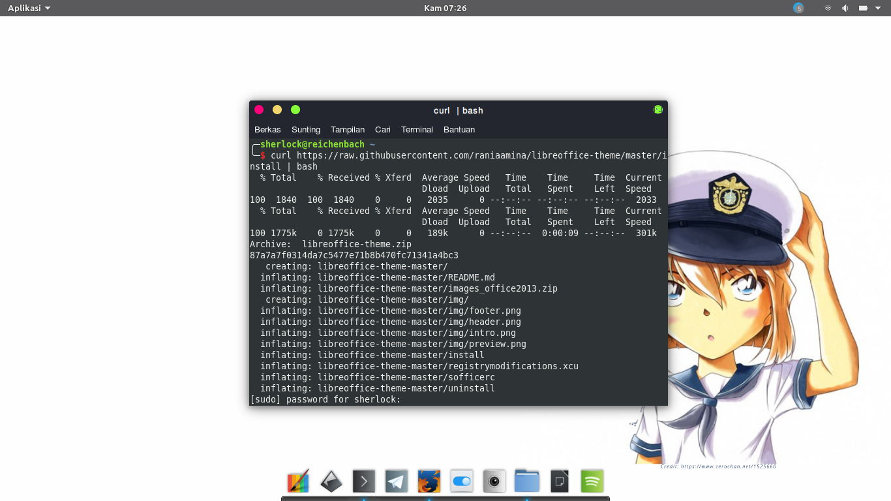
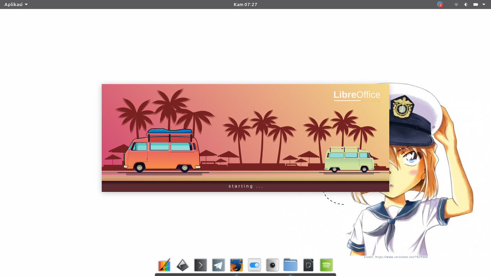
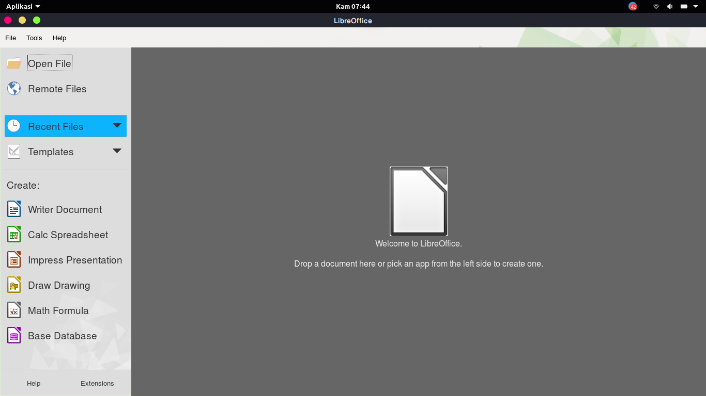
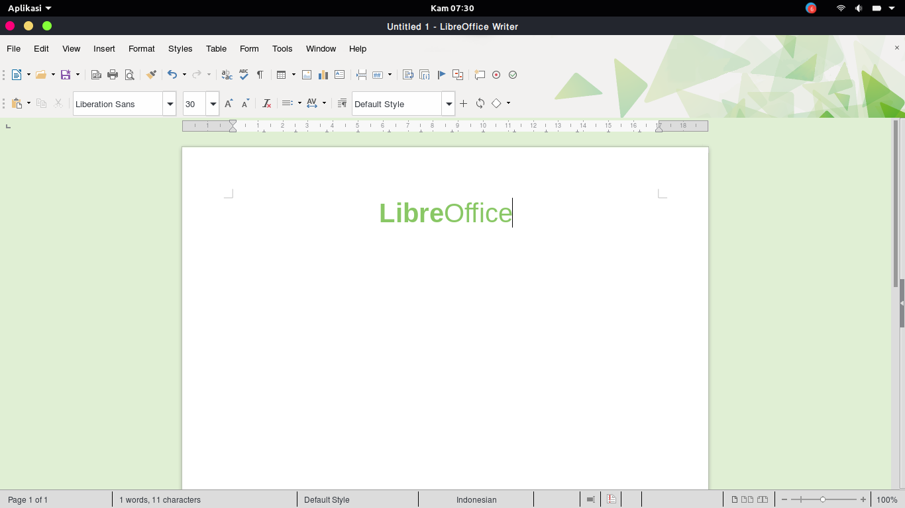

# libreoffice-theme
## Skrip untuk Mengubah Tampilan LibreOffice
Skrip ini dibuat untuk mempermudah pengguna LibreOffice mengubah tampilan LibreOffice menjadi lebih menarik. Bebeberapa hal yang akan diubah oleh skrip ini anatara lain; (a) *splash screen* LibreOffice, (b), tema ikon, dan (c) tema persona.
>Skrip ini belumlah sempurna dan masih perlu banyak perbaikan, silakan digunakan dengan kesadaran penuh bahwa RISIKO SEPENUHNYA DITANGGUNG SENDIRI!

## Tangkapan layar
**Proses pemasangan**



**Tampilan Splash**



**Tampilan Awal LibreOffice**



**Tampilan LibreOffice Writer**



## Pemasangan
Sebelum melakukan perintah pemasangan di bawah ini, pastikan paket `curl` telah dipasang di komputer Anda. Tutup semua program LibreOffice, kemudian jalankan perintah berikut di Terminal. Pemasangan ini membutuhkan akses **root** untuk menyalin beberapa elemen ke dalam sistem.

```bash
curl https://raw.githubusercontent.com/raniaamina/libreoffice-theme/master/install | bash
```

## Pencopotan
Lakukan pencopotan dengan menjalankan perintah ini, pencopotan akan memengembalikan LibreOffice Anda ke tampilan sebelumnya.
```bash
curl https://raw.githubusercontent.com/raniaamina/libreoffice-theme/master/uninstall | bash
```

## Kredit
- Skrip ini ditulis bersama [Sofyan Sugianto](http://t.me/artemtech)
- Tema persona diambil dari [Tema Persona Firefox - Light Ambiance](https://addons.mozilla.org/id/firefox/addon/libreoffice-4-light-ambiance/)
- Tema ikon *Office 2013 Theme for LibreOffice* oleh [Charliecnr](https://charliecnr.deviantart.com/art/Office-2013-theme-for-LibreOffice-512127527)
- Gambar original pada splash screen oleh [Fauzan](http://t.me/ozantliuky)
